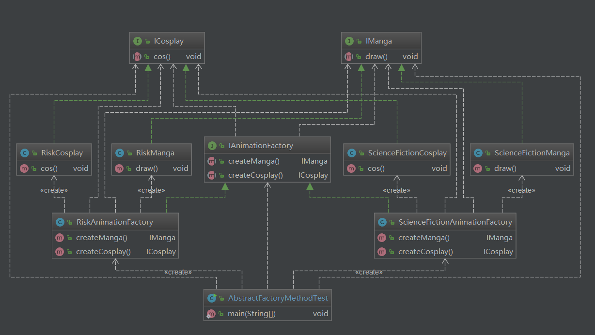

## 一、深刻理解产品族和产品等级结构之间的关系

抽象工厂是同一产品族的所有产品工厂的集合，一个抽象工厂可以生产同一产品族的所有产品，例如上图，
scienceFictionAnimationFactory生产科幻动漫的漫画和cosplay，riskAnimationFactory生产冒险动漫的
漫画和cosplay，产品等级就是漫画和cosplay。
 总结：抽象工厂的具体工厂用来生产同一产品族的不同产品等级结构的产品。
## 二、工厂模式  
### 简单工厂
1、工厂会有一个create静态方法，所以也叫静态工厂。  
2、简单工厂不属于23种常用设计模式。  
3、需要通过参数进行控制来创建不同的对象。  
4、扩展性差。  
5、不同的产品需要不同的参数时不支持。  
### 工厂方法
1、23种常用设计模式之一。  
2、具体的产品由具体的工厂进行生产，工厂的职责更明确清晰。  
3、可一定程度上解耦，产品的生产和实现类进行分开，只依赖产品接口。  
4、消费者完全不知道产品的实现过程也不需要知道。  
5、定义一个创建对象的接口，但由子类决定要实例化的类是哪一个，工厂方法把类的实例化推迟到子类。  
### 抽象工厂
1、23种常用设计模式之一。  
2、一个抽象工厂就是多个产品工厂的集合。  
3、每个具体工厂用于生产多个具体产品。  
4、分工更明确，职责更清晰。  
### 总结
简单工厂：不能算是真正意义上的设计模式，但是可以将客户程序从具体类解耦。  
工厂方法：将对象的实例化推迟到子类，由子类实现创建方法，可以看作是抽象工厂模式中只有单一产品的情况。  
抽象工厂：一个通用的工厂接口，对象的创建交给具体的工厂实现。  
工厂模式可以帮助我们针对抽象/接口编程，而不是针对具体类编程，在不同的场景下按具体情况来使用。

