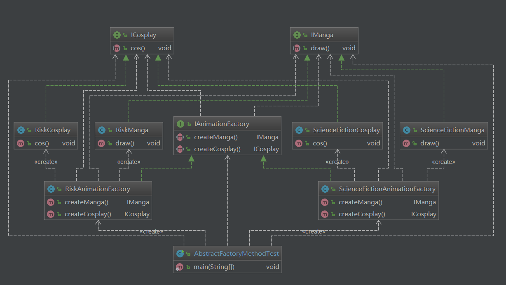

## 一、深刻理解产品族和产品等级结构之间的关系

抽象工厂是同一产品族的所有产品工厂的集合，一个抽象工厂可以生产同一产品族的所有产品，例如上图，
scienceFictionAnimationFactory生产科幻动漫的漫画和cosplay，riskAnimationFactory生产冒险动漫的
漫画和cosplay，产品等级就是漫画和cosplay
 总结：抽象工厂的具体工厂用来生产同一产品族的不同产品等级结构的产品
